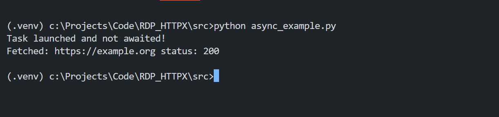
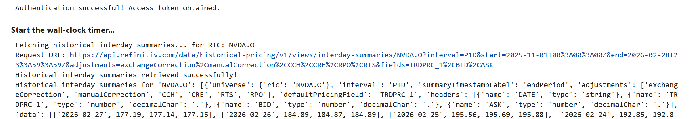
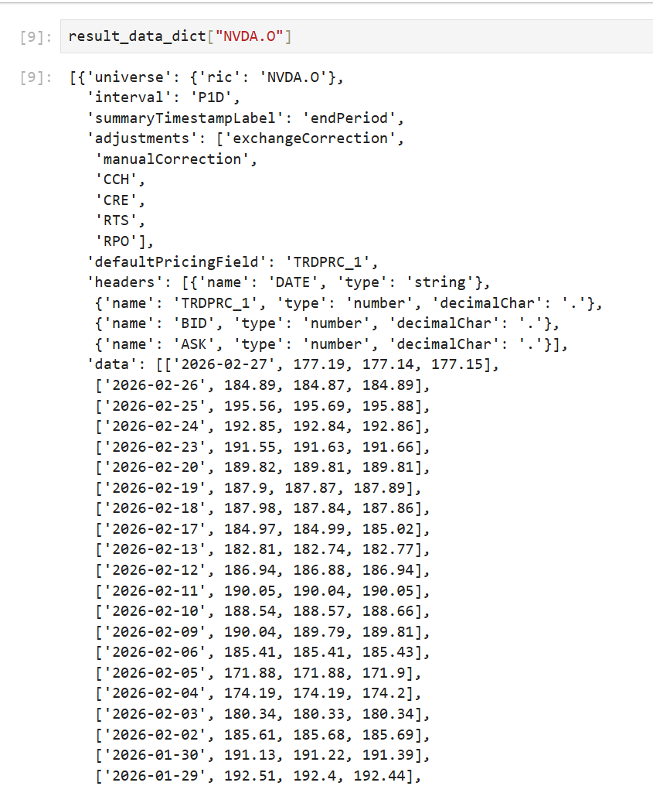
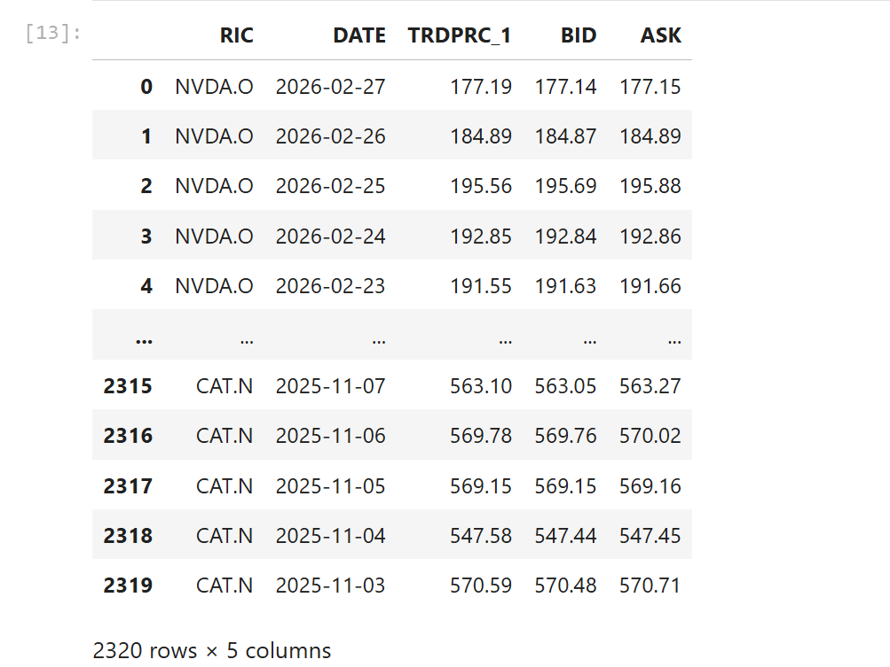
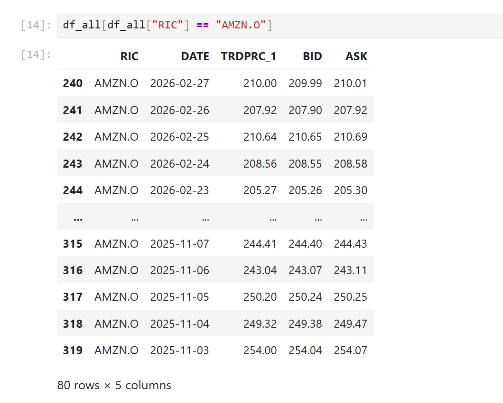

# Concurrent LSEG Data Platform API Calls with Python Asyncio and HTTPX

- Version: 1.0
- Last update: Apr 2026
- Environment: Python + JupyterLab + Data Platform Account
- Prerequisite: Data Platform access/entitlements

## Overview

The [Requests](https://requests.readthedocs.io/en/latest/) library is widely regarded as *the de facto* standard HTTP client for Python applications. Many Python developers first learn REST API calls through Requests — including through our [Data Platform APIs Tutorials](https://developers.lseg.com/en/api-catalog/refinitiv-data-platform/refinitiv-data-platform-apis/tutorials) (or you can try RDP HTTP operations with the [built-in http.client](https://docs.python.org/3/library/http.client.html) if you enjoy a challenge.).

That said, there are other Python HTTP libraries worth considering — [HTTPX](https://www.python-httpx.org/), [Aiohttp](https://docs.aiohttp.org/en/stable/), [Urllib3](https://urllib3.readthedocs.io/en/stable/), [Grequests](https://pypi.org/project/grequests/), [PycURL](http://pycurl.io/docs/latest/index.html), and more — each offering different trade-offs in performance and features that may better suit your requirements.

I was drawn to HTTPX because it provides a **requests-compatible API** while also supporting **asynchronous operations** out of the box. That combination made migrating from Requests to HTTPX straightforward, with the added benefit of async support when needed.

This article shows how to use [HTTPX](https://www.python-httpx.org/) with [LSEG Data Platform APIs](https://developers.lseg.com/en/api-catalog/refinitiv-data-platform/refinitiv-data-platform-apis) for authentication and data retrieval, with side-by-side synchronous and asynchronous examples. Its main purpose is to demonstrate the practical benefit of concurrent asynchronous HTTP calls: when many requests are needed, total wall-clock time is typically much lower than sequential execution while still allowing controlled throttling.

**Note**: A basic knowledge of Python [built-in asyncio](https://docs.python.org/3/library/asyncio.html) library is required to understand example codes.

## What are Data Platform APIs?

Let’s start with what the Data Platform APIs are. [LSEG Data Platform](https://developers.lseg.com/en/api-catalog/refinitiv-data-platform/refinitiv-data-platform-apis) (RDP APIs, also known as Delivery Platform in LSEG Real-Time) provides simple web based API access to a broad range of LSEG content.

RDP APIs give developers seamless and holistic access to all of the LSEG content such as Historical Pricing, Environmental Social and Governance (ESG), News, Research, etc, and commingled with their content, enriching, integrating, and distributing the data through a single interface, delivered wherever they need it.  The RDP APIs delivery mechanisms are the following:
* Request - Response: RESTful web service (HTTP GET, POST, PUT or DELETE) 
* Alert: delivery is a mechanism to receive asynchronous updates (alerts) to a subscription. 
* Bulks:  deliver substantial payloads, like the end-of-day pricing data for the whole venue. 
* Streaming: deliver real-time delivery of messages.

This example project is focusing on the Request-Response: RESTful web service delivery method only.  

For more detail regarding the Data Platform, please see the following APIs resources: 
- [Quick Start](https://developers.lseg.com/en/api-catalog/refinitiv-data-platform/refinitiv-data-platform-apis/quick-start) page.
- [Tutorials](https://developers.lseg.com/en/api-catalog/refinitiv-data-platform/refinitiv-data-platform-apis/tutorials) page.
- [RDP APIs: Introduction to the Request-Response API](https://developers.lseg.com/en/api-catalog/refinitiv-data-platform/refinitiv-data-platform-apis/tutorials#introduction-to-the-request-response-api) page.

That covers and overview of Data Platform APIs.

## What is HTTPX?

Now let me turn to HTTPX library introduction. [HTTPX](https://www.python-httpx.org/) is a full featured modern HTTP client for Python 3. It provides a set of synchronous and modern asynchronous APIs with [HTTP/2](https://httpwg.org/specs/rfc7540.html) supported. It is largely [compatible with the Requests library](https://www.python-httpx.org/compatibility/), so any Python developers can migrate their existing [Requests](https://requests.readthedocs.io/en/latest/) library code to the HTTPX easily.

```python
import httpx

# Get
params = {'key1': 'value1', 'key2': 'value2'}
r = httpx.get('https://httpbin.org/get', params=params)
r.raise_for_status()
print(r.json())

# HTTP Post
data = {'integer': 123, 'boolean': True, 'list': ['a', 'b', 'c']}
r = httpx.post('https://httpbin.org/post', json=data)
r.raise_for_status()
print(r.json())
```

For synchronous use, HTTPX also provides [`httpx.Client`](https://www.python-httpx.org/advanced/clients/) object which is the equivalent of `requests.Session()` — it maintains a shared connection pool across multiple requests:

Example:

```python
import httpx

with httpx.Client(base_url='http://httpbin.org') as client:
  r = client.get('/get')
  r.raise_for_status()
  print(r.status_code)
```

For asynchronous use, [`httpx.AsyncClient`](https://www.python-httpx.org/api/#asyncclient) object to work with [asyncio](https://docs.python.org/3/library/asyncio.html), [Trio](https://trio.readthedocs.io/en/stable/), and [AnyIO](https://anyio.readthedocs.io/en/stable/). I am demonstrating with asyncio in this project.:

Example:

```python
import asyncio
import httpx

async def main():
    async with httpx.AsyncClient() as client:
        response = await client.get('https://www.example.com/')
        print(response)

asyncio.run(main())
```

That’s all I have to say about HTTPX library introduction.

## What are Synchronous and Asynchronous Execution Models?

That brings us to Synchronous and Asynchronous terms. What are they? 

**Synchronous** code runs tasks one at a time in a strict sequence — each task must finish before the next one starts. The application pauses and waits at every blocking call. For example, the `httpx.get()` function call below (equivalent to `requests.get()`) blocks the entire program until the HTTP response arrives:

```python
import httpx

def fetch(url):
    """Fetch the content of the URL synchronously."""
    r = httpx.get(url, verify=False)
    print("Fetched:", url, "status:", r.status_code)
    return r.text

def main():
    """ Main function."""
    fetch("https://example.org")
    print("This line prints ONLY after the request is done!")

if __name__ == "__main__":
    main()
```


If the HTTP request takes 60 seconds, the program idles for those 60 seconds before executing the next line. For a single request this is fine, but it becomes a bottleneck when you need to fetch data for many symbols or endpoints.


On the other hand, **Asynchronous** code allows multiple tasks to run concurrently in a non-blocking manner. While one task is waiting for I/O (such as a network response), the event loop can hand control to another task (execute next line of codes) instead of sitting idle. The example below uses `asyncio.create_task()` method to launch a fetch in the background and immediately continues to the next line — without waiting for the response:

```python
import asyncio
import httpx 

async def fetch(url):
    """Fetch the content of the URL asynchronously."""
    async with httpx.AsyncClient(verify=False) as client:
        r = await client.get(url)
        print("Fetched:", url, "status:", r.status_code)
        return r.text

async def main():
    """ Main function."""
    asyncio.create_task(fetch("https://example.org"))
    print("Task launched and not awaited!")
    # Sleep to allow the fetch task to complete before the program exits.
    await asyncio.sleep(2) 
if __name__ == "__main__":
    asyncio.run(main())
```




The real payoff of async comes when you have **many requests to make**. With `asyncio.gather()`, you can fire all of them concurrently so the total wall-clock time is roughly that of the single slowest response — instead of the sum of all response times. That is exactly the pattern used in `example_async_gather.py` and `async_call_nb.ipynb` examples for fetching multiple RICs.

### What are Coroutines?

You will see a term **coroutines** a lot in this article. What does it mean? The [Python Coroutines](https://docs.python.org/3/library/asyncio-task.html#coroutines) is functions that can pause and resume their execution, allowing other tasks to run in the meantime. The coroutines functions always declared with the `async/await` syntax like the asynchronous Python asyncio example above.

Let’s leave the Synchronous/Asynchronous definition there.

## Throttling and Rate Limits 

Now, what about Data Platform APIs request limit. The Data Platform API request limits (throttles) to effectively manage and protect its service and ensure fair usage across the non-streaming content. 

An application would receive an error from the API call if an application reached or exceeds a limit (especially with the Asynchronous HTTP calls). You required to make some necessary adjustments to rectify the interaction with the API and retry the respective API call. 

Two different server errors on API request limits are: 

| **HTTP Status** | **Detail** |
| --- | --- |
| **429** | **Error Message**: too many attempts |
|  | **Description**: A per account limit where the number of requests per second is limited for each account accessing the platform. If this limit is reached, applications will receive a standard HTTP error (HTTP 429 too many requests). |
|  | **Suggestion**: Please reduce the number of requests per second and retry. |

Please find more detail regarding the Data Platform HTTP error status messages from the [RDP API General Guidelines](https://developers.lseg.com/en/api-catalog/refinitiv-data-platform/refinitiv-data-platform-apis/documentation) document page.

The Historical Pricing endpoint rate limits information is available on the **Reference** tab of the [Data Platform API Playground](https://apidocs.refinitiv.com/Apps/ApiDocs) page. The current rate limits (**As of Mar 2026**) is as follows:


## Security Notes

- All examples use `verify=False` parameter to disable TLS certificate verification. This is intended for local/dev environments only (e.g. where a TLS-inspecting proxy such as ZScaler is in use). Remove `verify=False` parameterparameter or supply a proper CA bundle for production use.
- Do not log or print access tokens in production applications.

## Code Walkthrough

Now we come to the code walkthrough. This article focuses primarily on the asynchronous code. Synchronous equivalents are shown in select places for comparison.

The examples use the following Python libraries for demonstration in Jupyter Notebook files.

| Library | Purpose |
| --- | --- |
| `asyncio` | Python's built-in async event loop and concurrency primitives |
| `os` | Read environment variables |
| `time` | Wall-clock timing via `time.perf_counter()` statement |
| `httpx` | Async HTTP client |
| `IPython.display` | Render formatted Markdown output in the notebook |
| `dotenv` | Load credentials from `src/.env` file |

### Data Platform Authentication

Let's start with the authentication. The first step of any application workflow is to log in to the RDP Auth Service.

The required credentials are:

- **Username**: The machine ID associated with your account.
- **Password**: The password for the machine ID.
- **Client ID (AppKey)**: A unique identifier for your app, generated via the App Key Generator. Keep it private.
- **Grant Type `password`: Used for the initial authentication request with a username/password combination.

I strongly suggest reading the [Data Platform: Authorization - All about tokens](https://developers.lseg.com/en/api-catalog/refinitiv-data-platform/refinitiv-data-platform-apis/tutorials#authorization-all-about-tokens) tutorial for a deeper understanding of RDP authentication.

The authentication function uses Python's [`async`](https://docs.python.org/3/reference/compound_stmts.html#async-def)/[`await`](https://docs.python.org/3/reference/expressions.html#await) syntax so the HTTP request can be suspended and resumed when the network response arrives — without blocking other tasks. The `client` parameter is a shared `httpx.AsyncClient` instance passed in from the caller, so the same underlying TCP connection pool is reused across all requests rather than opening a new connection each time.

```python
async def post_authentication_async(machine_id, password, app_key, url, client):
    """Authenticate to RDP and return the token response as JSON."""

    # Build the OAuth 2.0 Password Grant request payload.
    # Sent as application/x-www-form-urlencoded (httpx encodes a dict automatically).
    payload = {
        "username": machine_id,
        "password": password,
        "grant_type": "password",
        "scope": "trapi",
        "takeExclusiveSignOnControl": "true",
        "client_id": app_key
    }

    # Send authentication request to the OAuth token endpoint.
    # `data=payload` sends a form body required by this endpoint.
    response_auth = await client.post(url, data=payload, headers=headers)
    # Raise for 4xx/5xx API failures.
    response_auth.raise_for_status() 
    return response_auth.json()
```

The `raise_for_status()` statement call handles any non-[HTTP 200 OK](https://developer.mozilla.org/en-US/docs/Web/HTTP/Reference/Status/200) response — such as 4xx or 5xx errors — by raising an exception that propagates back to the caller.

The `post_authentication_async` method sends a single HTTP POST request to the RDP authentication endpoint asynchronously and retrieves the access token for use in subsequent data requests. Nothing too exciting here — just a straightforward async HTTP call.

You maybe noticed that the code just define a function is like a normal HTTP POST request function except the following different:

- define a function name with `async def` syntax
- call the `AsyncClient.post()` statement with `await` syntax

Moving on to the main code. The `async with` block opens a shared `httpx.AsyncClient` instance and guarantees its connection pool is closed cleanly when the block exits, whether it completes normally or raises an exception. Inside the block, `post_authentication_async()` method **is awaited** to obtain the Bearer token before any data requests are made.

```python
# Main Code
async with httpx.AsyncClient(
    verify=False,
    base_url=base_url,
    timeout=10.0,
    follow_redirects=True,
) as client:
    # --- Authentication (must complete before any data requests) ---
    try:
        token_data = await post_authentication_async(machine_id, password, app_key, AUTH_TOKEN_URL, client)
        print("Authentication successful. Access token obtained.")

        access_token = token_data.get("access_token")

    # --- Exception handlers ordered from most-specific to least-specific ---
    except httpx.HTTPStatusError as e:
        # Server returned a 4xx or 5xx status code.
        print(f"HTTP error during request: {e.request.url} {e.response.status_code} - {e.response.text}")
    except httpx.TimeoutException as e:
        # Request exceeded the configured timeout (must precede RequestError
        # because TimeoutException is a subclass of RequestError).
        print(f"Timeout error: {e}")
    except httpx.RequestError as e:
        # Network-level failure: DNS, connection refused, SSL error, etc.
        print(f"Network error: {e}")
    except Exception as e:
        # Catch-all for unexpected errors (e.g. JSON decode, assertion).
        print(f"Unexpected error: {e}")
```

#### Where is asyncio.run(main())?

You might wonder why the main code does not call `asyncio.run(main())` statement. The reason is that Jupyter natively supports top-level `await`, so no `asyncio.run()` wrapper is needed.

If your target platform is non-Jupyter environment, you need call asynchronous code and method in `asyncio.run(main())` statement as follows:

```python
import asyncio

async def man()
    await something()

if __name__ == "__main__":
    
    asyncio.run(main())
```

### Comparing to Synchronous Code

For a single HTTP request, the synchronous equivalent is *almost* identical. The only real differences are the absence of `async`/`await` and the use of `httpx.Client` instance instead of `httpx.AsyncClient`. The code runs line by line — each statement blocks and waits for the network response before moving on.

```python
def post_authentication(machine_id, password, app_key, url, client):
    """Authenticate to RDP and return the token response as JSON."""

    payload = { ... } # same as the Async Code
    # no await
    response = client.post(url, data=payload)
    response.raise_for_status()  
    return response.json()

...

# Main code, use httpx.Client.
with httpx.Client(
    verify=False,
    base_url="https://api.refinitiv.com",
    timeout=10.0,
    default_encoding="utf-8",
    follow_redirects=True,
) as client:
    try:
        # Authenticate and get the access token.
        auth_response = post_authentication(machine_id, password, app_key, AUTH_TOKEN_URL, client)
        access_token = auth_response["access_token"]
        print("Authentication successful! Access token obtained.\n")
    except httpx.HTTPStatusError as exc:
        print(f"HTTP error occurred during HTTP Request: {exc.request.url}: {exc.response.status_code} - {exc.response.text}")
    ...
```

Once authentication succeeds, the function parses the RDP Auth service response and stores the following token fields:

- **access_token**: The token used to invoke REST data API calls as described above. The application must keep this credential for further RDP APIs requests.
- **refresh_token**: Refresh token to be used for obtaining an updated access token before expiration. The application must keep this credential for access token renewal.
- **expires_in**: Access token validity time in seconds.

### Requesting RDP APIs Data

That brings us to requesting the RDP APIs data. All subsequent REST API calls must pass the Access Token via the `Authorization` HTTP request header as shown below. 
- Header: 
    * Authorization = ```Bearer <RDP Access Token>```

Please notice *the space* between the ```Bearer``` and ```RDP Access Token``` values.

The application then builds a request message — either as a JSON body or URL query parameters depending on the service — and sends it to the appropriate API Endpoint. You can find each endpoint's HTTP operations and parameters on Data Platform's [API Playground page](https://apidocs.refinitiv.com/Apps/ApiDocs), an interactive documentation site available to anyone with a valid Data Platform account.

### Getting Multiple Historical Pricing Data Asynchronously 

Moving on to the main benefit of the asynchronous execution model: performing multiple I/O tasks in parallel, like sending multiple HTTP requests at once. I am demonstrating this with the `/data/historical-pricing/v1/views/interday-summaries/{universe}` endpoint, which retrieves time series pricing Interday summaries data (i.e. bar data) for a single RIC code via the following HTTP structure.

```http
GET /data/historical-pricing/v1/views/interday-summaries/{RIC Code}?{params} HTTP/1.1
Authorization: Bearer {access token}
Host: api.refinitiv.com
```

I am using 30 RICs from various exchanges — S&P 500, Nasdaq Composite, and others — as sample RIC codes.

```python
HISTORICAL_RICS = ["NVDA.O","AAPL.O","MSFT.O","AMZN.O","GOOG.O","AVGO.O","META.O","ORCL.N","IBM.N","PLTR.O","NFLX.O","TSLA.O","CRM.N","AMD.O","INTC.O","ARM.O","ASML.AS","CSCO.O","WMT.O","LLY.N","JPM.N","XOM.N","V.N","JNJ.N","MU.O","MA.N","COST.O","CVX.N","BAC.N","CAT.N"] 
```

Please note that my Data Platform account *does not have permission* to retrieve [ASML](https://www.asml.com/en) (`ASML.AS`) data. I included this RIC intentionally to demonstrate how to handle an error with asynchronous execution model.

That brings us to the code that sends HTTP GET request to the Data Platform `/data/historical-pricing/v1/views/interday-summaries/{universe}` endpoint. 

```python
async def get_historical_interday_summaries_async(ric, token, url, client, interval, start, end, fields, semaphore=None):
    """Request historical Interday summaries data for a single RIC."""
    print(f"Fetching historical interday summaries... for RIC: {ric}")

    # Bearer token authenticates the caller; Content-Type signals a JSON response is expected.
    headers = {
        "Authorization": f"Bearer {token}",
        "Content-Type": "application/json"
    }

    # Build the query string for the interday-summaries endpoint.
    # adjustments: apply standard corporate-action and price corrections so that
    # the returned series is comparable across the full date range.
    # fields: comma-separated list of data columns to include in the response.
    params = {
        "interval": interval,
        "start": start,
        "end": end,
        "adjustments": "exchangeCorrection,manualCorrection,CCH,CRE,RPO,RTS",
        "fields": ",".join(fields)
    }

    # Acquire the semaphore slot before sending the request so that at most
    # `semaphore._value` (e.g. 3) requests are in-flight at the same time.
    # When no semaphore is provided, send the request immediately without throttling.
    if semaphore:
        async with semaphore:
            response_history = await client.get(f"{url}{ric}", params=params, headers=headers)
    else:
        response_history = await client.get(f"{url}{ric}", params=params, headers=headers)

    print(f"Request URL: {response_history.url}")

    # Raise an exception for 4xx/5xx HTTP errors; lets the caller handle
    # status-specific logic (e.g. 429 rate-limit vs. 401 auth failure).
    response_history.raise_for_status()

    # Deserialise and return the JSON payload for further processing by the caller.
    return response_history.json()
```

The `get_historical_interday_summaries_async` method sends a single HTTP GET request to the RDP endpoint asynchronously and retrieves historical data from the Data Platform. Like the `post_authentication_async` method above, it defines a method with `async def` syntax and calls `AsyncClient.get()` with `await` syntax.

You may have noticed the `semaphore` parameter. This [`asyncio.Semaphore`](https://docs.python.org/3/library/asyncio-sync.html#asyncio.Semaphore) object limits the number of concurrent coroutines that can access a specific resource or block of code simultaneously (throttle). To call `AsyncClient.get()` statement with a semaphore, use the following code:

```python
# Acquire the semaphore slot before sending the request so that at most
# `semaphore._value` (e.g. 3) requests are in-flight at the same time.
# When no semaphore is provided, send the request immediately without throttling.
if semaphore:
    async with semaphore:
        response_history = await client.get(f"{url}{ric}", params=params, headers=headers)
```

Now we have the code to get Historical Pricing asynchronously, let move on the the main code that calls the `get_historical_interday_summaries_async` method.

On the main code, I am calling the `get_historical_interday_summaries_async` method inside the same `async with` block with a shared `httpx.AsyncClient` as follows:

```python
async with httpx.AsyncClient(
    verify=False,
    base_url="https://api.refinitiv.com",
    timeout=10.0,
    follow_redirects=True,
) as client:
    
    try:
        # --- Authentication (must complete before any data requests) ---
        access_token = token_data.get("access_token")

        display(Markdown("**Start the wall-clock timer...**"))
        start_time = time.perf_counter()

        # Limit how many RIC requests run simultaneously to avoid
        # overwhelming the server or hitting rate limits.
        max_concurrent_tasks = 10
        sem = asyncio.Semaphore(max_concurrent_tasks)

        fields = ["TRDPRC_1", "BID", "ASK"]
        start_date = "2025-11-01T00:00:00Z"
        end_date = "2026-02-28T23:59:59Z"

        # Build one coroutine per RIC; the semaphore inside each call
        # ensures at most max_concurrent_tasks run at the same time.
        tasks_history = [
            get_historical_interday_summaries_async(
                ric, access_token, HISTORICAL_INTERDAY_SUMMARIES_URL, client,
                interval="P1D", start=start_date, end=end_date, fields=fields, semaphore=sem
            )
            for ric in HISTORICAL_RICS
        ]

        # gather() runs all tasks concurrently. return_exceptions=True
        # prevents a single failure from cancelling the remaining tasks —
        # each exception is returned as a value instead of being raised.
        results_history = await asyncio.gather(*tasks_history, return_exceptions=True)

        # Pair each RIC with its result (or exception)  to be a dictionary, and handle individually.
        result_data_dict = dict(zip(HISTORICAL_RICS, results_history))
        for ric, result in result_data_dict.items():
            if isinstance(result, httpx.HTTPStatusError):
                raise result   # 4xx / 5xx HTTP response
            elif isinstance(result, httpx.RequestError):
                raise result   # network-level failure (includes timeouts)
            elif isinstance(result, Exception):
                raise result   # any other unexpected error
            print(f"Historical interday summaries for '{ric}': {result}\n\n")

        elapsed = time.perf_counter() - start_time
        elapsed_string = f"**Sending Historical-Pricing for ({len(HISTORICAL_RICS)} RICs (with throttling {max_concurrent_tasks})) in {elapsed:0.2f} seconds.**"
        display(Markdown(elapsed_string))

        # revoke access token code

    # --- Exception handlers ordered from most-specific to least-specific ---
    except httpx.HTTPStatusError as e:
        # Server returned a 4xx or 5xx status code.
        print(f"HTTP error during request: {e.request.url} {e.response.status_code} - {e.response.text}")
    ...
```

So, now let’s look at the code part-by-part. The main code starts a wall-clock timer after receiving an access token from the Data Platform, and print out that it start the timer using Jupyter [`display`](https://ipython.readthedocs.io/en/stable/api/generated/IPython.display.html) module.

```python
# --- Authentication (must complete before any data requests) ---

display(Markdown("**Start the wall-clock timer...**"))
start_time = time.perf_counter()
```

Next, it creates a semaphore and builds a list of `get_historical_interday_summaries_async` coroutines — one per RIC — stored in the `tasks_history` list. The maximum concurrent coroutines is set to *10* via `asyncio.Semaphore` object.

```python
# Limit how many RIC requests run simultaneously to avoid
# overwhelming the server or hitting rate limits.
max_concurrent_tasks = 10
sem = asyncio.Semaphore(max_concurrent_tasks)
# Build one coroutine per RIC; the semaphore inside each call
# ensures at most max_concurrent_tasks run at the same time.
tasks_history = [
    get_historical_interday_summaries_async(
        ric, access_token, HISTORICAL_INTERDAY_SUMMARIES_URL, client,
        interval="P1D", start=start_date, end=end_date, fields=fields, semaphore=sem
    )
    for ric in HISTORICAL_RICS
]
```

That brings us to [`asyncio.gather`](https://docs.python.org/3/library/asyncio-task.html#asyncio.gather) method, which runs all the coroutines in `tasks_history` **concurrently**. The `return_exceptions=True` parameter ensures that any exception from a coroutine is returned as a result value rather than being raised immediately — so a single failure does not cancel the remaining tasks. All coroutines tasks in the group are allowed to complete regardless of errors.

```python
# gather() runs all tasks concurrently. return_exceptions=True
# prevents a single failure from cancelling the remaining tasks —
# each exception is returned as a value instead of being raised.
results_history = await asyncio.gather(*tasks_history, return_exceptions=True)
```

Since the final list (our `result_history` variable) contains a mix of successful results and exception object, the code must manual iterate through the results and check their types to handle errors individually. 

```python
# Pair each RIC with its result (or exception)  to be a dictionary, and handle individually.
result_data_dict = dict(zip(HISTORICAL_RICS, results_history))
for ric, result in result_data_dict.items():
    if isinstance(result, httpx.HTTPStatusError):
        raise result   # 4xx / 5xx HTTP response
    elif isinstance(result, httpx.RequestError):
        raise result   # network-level failure (includes timeouts)
    elif isinstance(result, Exception):
        raise result   # any other unexpected error
    print(f"Historical interday summaries for '{ric}': {result}\n\n")
```

For the `ASML.AS` RIC that my account does not have permission for, the Data Platform Historical Pricing endpoint returns *HTTP 200 (OK)* — but with a permission-denied payload in the response body. Because it is not a 4xx/5xx error, it passes the exception checks and ends up in `result_data_dict` variable as a regular result.

```json
[
    {
        "universe": {
            "ric": "ASML.AS"
        },
        "status": {
            "code": "TS.Interday.UserNotPermission.70112",
            "message": "User does not have permission for this universe."
        }
    }
]
```

And lastly, check the time used by all 30 RIC requests and print out the number of seconds using Jupyter [`display`](https://ipython.readthedocs.io/en/stable/api/generated/IPython.display.html) module.

```python
elapsed = time.perf_counter() - start_time
elapsed_string = f"**Sending Historical-Pricing for ({len(HISTORICAL_RICS)} RICs (with throttling {max_concurrent_tasks})) in {elapsed:0.2f} seconds.**"
display(Markdown(elapsed_string))
```

Example Asynchronous Results

Start the timer:


Finished all Historical Pricing requests:


### Comparing to Synchronous Code

The synchronous `get_historical_interday_summaries` method is *almost* identical to its async counterpart. The only real differences are the absence of `async`/`await` syntax and the `semaphore` parameter, and the use of `httpx.Client` instance instead of `httpx.AsyncClient`. The code runs line by line — each call blocks and waits for the network response before moving on.

```python
def get_historical_interday_summaries(ric, token, url, client, interval, start, end, fields):
    """Request historical Interday summaries data for a single RIC."""
    print(f"Fetching historical interday summaries... for RIC: {ric}")

    headers = { ... }
    params = { ... }

    response_history =  client.get(f"{url}{ric}", params=params, headers=headers)

    print(f"Request URL: {response_history.url}")
   
    response_history.raise_for_status()
    # Deserialise and return the JSON payload for further processing by the caller.
    return response_history.json()

```

The synchronous main code is much simpler — it just loops over the `HISTORICAL_RICS` list and calls `get_historical_interday_summaries` method for each RIC one at a time, waiting for each response before moving to the next.

```python
# Main code, use httpx.Client.
with httpx.Client(
    verify=False,
    base_url="https://api.refinitiv.com",
    timeout=10.0,
    default_encoding="utf-8",
    follow_redirects=True,
) as client:
    try:
        # Authenticate and get the access token.
        
        access_token = auth_response["access_token"]

        display(Markdown("**Start the wall-clock timer...**"))
        start_time = time.perf_counter()

        for ric in HISTORICAL_RICS:
            history_data =  get_historical_interday_summaries(
                ric, access_token, HISTORICAL_INTERDAY_SUMMARIES_URL, client, interval="P1D", start=start_date, end=end_date, fields=fields
            )
            print("Historical interday summaries retrieved successfully!")
            print(f"Historical interday summaries for '{ric}': {history_data}\n\n")

        elapsed = time.perf_counter() - start_time
        elapsed_string = f"**Sending Historical-Pricing for ({len(HISTORICAL_RICS)}) RICs in {elapsed:0.2f} seconds.**"
        display(Markdown(elapsed_string))
        ...
    except httpx.HTTPStatusError as exc:
        print(f"HTTP error occurred during HTTP Request: {exc.request.url}: {exc.response.status_code} - {exc.response.text}")
    ...
```

Example Synchronous Results

Start the timer:



Finished all Historical Pricing requests:


**Note**: I intentionally waited for a period of time to minimize the impact of any potential network or endpoint data caching (if any) before comparing the results of the asynchronous and synchronous notebook examples.

That’s all I have to say about multiple RDP data request using asynchronous execution model.

### Bonus: Working with the Historical Data

The historical-pricing response is returned as a JSON payload. You can find the full message specification in the Historical Pricing endpoint's Reference Guide on the [Data Platform API Playground](https://apidocs.refinitiv.com/Apps/ApiDocs) page.

If your application works with raw JSON, you can use the data directly as-is.



If you prefer working with [Pandas DataFrames](https://pandas.pydata.org/docs/reference/api/pandas.DataFrame.html), the snippet below converts the results into one combined DataFrame. It first filters out any RICs that came back with a permission-denied payload (those won't have a `headers` field), then concatenates the remaining data into a single DataFrame with a `RIC` column at the front.

```python
# Clean Up all returns error message
result_data_dict = {
    ric: payload
    for ric, payload in result_data_dict.items()
    if isinstance(payload, list) and payload and "headers" in payload[0]
}

# Build one DataFrame per RIC and tag it with the RIC name via assign().
# Using a list comprehension + a single concat is faster than appending
# DataFrames in a loop, because concat allocates memory once for the full result.
df_all = pd.concat(
    [
        pd.DataFrame(
            payload[0]["data"],
            columns=[h["name"] for h in payload[0]["headers"]]  # Column names from the API response headers.
        ).assign(RIC=ric)   # Tag each row with its RIC; added as the last column for now.
        for ric, payload in result_data_dict.items()
    ],
    ignore_index=True,  # Reset the row index across all concatenated DataFrames.
)

# Reposition RIC as the first column — done once here rather than
# calling insert() on every individual DataFrame before concatenation.
df_all.insert(0, "RIC", df_all.pop("RIC"))
```



To filter the combined DataFrame down to a single RIC, use a boolean mask:

```python
df_all[df_all["RIC"] == "AMZN.O"]
```



That’s all I have to say about how to use historical-pricing data from Data Platform APIs.


## What If I Use Other Programming Languages?

The asynchronous execution model is not limited to Python. Most modern programming languages have built-in or well-supported async HTTP capabilities, so the same patterns demonstrated in this article — concurrent requests, throttling with a semaphore, and per-result error handling — translate naturally to other ecosystems.

Here are the async-capable HTTP clients for some popular languages:

| Language | Library / API |
| --- | --- |
| **Java** | [Built-in `HttpClient`](https://openjdk.org/groups/net/httpclient/intro.html) (Java 11+) | 
| **Java** | [Apache HttpClient 5](https://hc.apache.org/httpcomponents-client-5.6.x/index.html) | 
| **C#** | [Built-in `HttpClient`](https://learn.microsoft.com/en-us/dotnet/api/system.net.http.httpclient) | 
| **JavaScript / TypeScript** | [Built-in Fetch API](https://developer.mozilla.org/en-US/docs/Web/API/Fetch_API/Using_Fetch) | 
| **Go** | [Native `net/http`](https://pkg.go.dev/net/http#Client) |

In all cases, the general approach is the same: fire multiple requests concurrently, cap the in-flight count to stay within server rate limits, and handle each result independently so a single failure does not abort the rest.

## Conclusion

Before I finish, let me wrap up with a few key takeaways.

Asynchronous execution model is a powerful tool when you need to make many HTTP requests at once. As demonstrated in this project, using `asyncio.gather()` with a shared `httpx.AsyncClient` lets all 30 RIC requests run concurrently — so the total wall-clock time is roughly that of the single slowest response, rather than the sum of all response times. That is a significant improvement over the synchronous approach, where each request must wait for the previous one to complete before moving on.

That said, async code does introduce more moving parts — coroutines, semaphores, and per-result exception handling — so it is worth asking whether that complexity is justified for your use case. For a small number of requests, or for applications that are naturally sequential, the simpler synchronous approach is probably the better choice. For bulk data retrieval across many instruments, async pays off quickly.

[HTTPX](https://www.python-httpx.org/) is what makes this all come together cleanly. Its [Requests-compatible API](https://www.python-httpx.org/compatibility/) means there is almost no learning curve if you are already familiar with the Requests library — the method names, parameters, and response objects are nearly identical. At the same time, HTTPX ships with [first-class async support](https://www.python-httpx.org/async/) out of the box via `httpx.AsyncClient`, so you can adopt the asynchronous model without switching to a completely different library. On top of that, HTTPX offers a set of modern API features — built-in connection pooling via `Client`/`AsyncClient`, timeout configuration, automatic redirect following, and HTTP/2 support — that make it a solid drop-in upgrade from Requests for both simple scripts and production applications.

[LSEG Data Platform](https://developers.lseg.com/en/api-catalog/refinitiv-data-platform/refinitiv-data-platform-apis) provide a straightforward, RESTful interface to a broad range of financial content — Historical Pricing, ESG, News, Research, and more — all behind a single OAuth 2.0 authenticated endpoint. The [API Playground](https://apidocs.refinitiv.com/Apps/ApiDocs) is a great starting point for exploring available endpoints, parameters, and response schemas.

**One important thing to keep in mind**: the Data Platform enforces per-account rate limits. If you send too many concurrent requests, you will receive an **HTTP 429 Too Many Requests** error. Always throttles your concurrency, and be ready to reduce your request rate if you start seeing 429 responses.

## Next Step 

The `asyncio.gather` is not the only option that Python Asyncio offers for developers.  If you prefer to manual manage and run coroutine, the [`asyncio.create_task`](https://docs.python.org/3/library/asyncio-task.html#asyncio.create_task) might suite your need. This low-level method schedules a coroutine to run as a background task immediately, without waiting.

Introduced in Python version 3.11, [`asyncio.TaskGroup`](https://docs.python.org/3/library/asyncio-task.html#asyncio.TaskGroup) provides a modern, cleaner, and fail-safe way for structured concurrency I/O bound operations. It is suitable for I/O pipelines that any failure should abort the whole operation.

There are much more Data Platform endpoints, HTTPX and Asyncio features that you can explore to find the things that suite your technical and business needs. For further reading, I recommend the following resources:

- [Data Platform APIs Quick Start](https://developers.lseg.com/en/api-catalog/refinitiv-data-platform/refinitiv-data-platform-apis/quick-start)
- [Data Platform APIs Tutorials](https://developers.lseg.com/en/api-catalog/refinitiv-data-platform/refinitiv-data-platform-apis/tutorials)
- [Data Platform APIs Documents](https://developers.lseg.com/en/api-catalog/refinitiv-data-platform/refinitiv-data-platform-apis/documents)
- [HTTPX Documentation](https://www.python-httpx.org/)
- [Python asyncio Documentation](https://docs.python.org/3/library/asyncio.html)