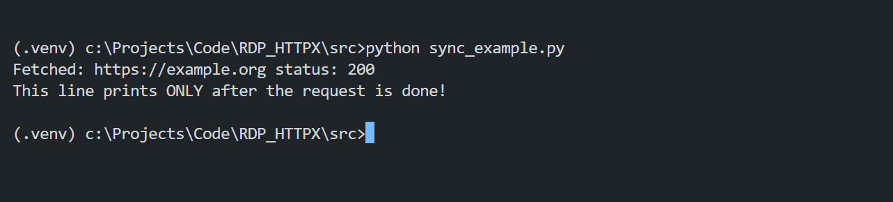
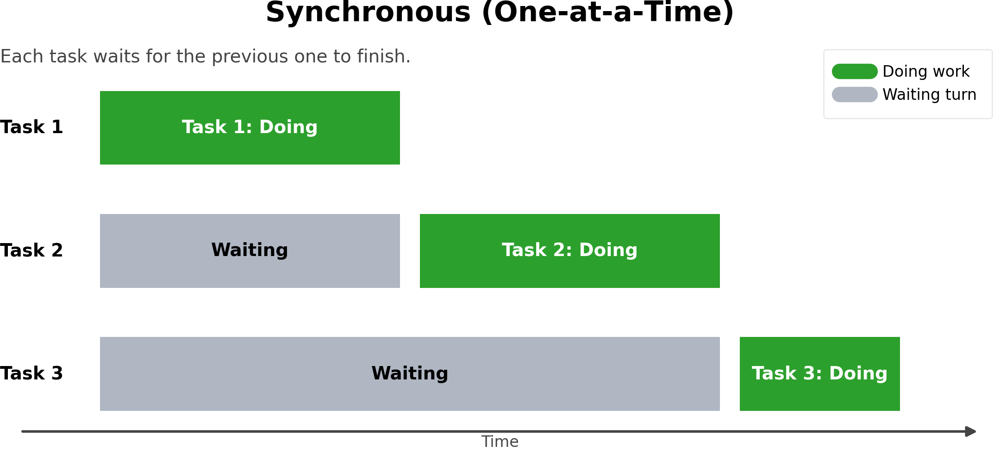

# Data Platform APIs HTTP REST Application using Httpx

- Version: 1.0
- Last update: Mar 2026
- Environment: Python + JupyterLab + Data Platform Account
- Prerequisite: Data Platform access/entitlements

## Overview

The [Requests](https://requests.readthedocs.io/en/latest/) library is widely regarded as *the de facto* standard HTTP client for Python applications. Many Python developers first learn REST API calls through Requests — including through our [Data Platform APIs Tutorials](https://developers.lseg.com/en/api-catalog/refinitiv-data-platform/refinitiv-data-platform-apis/tutorials) (or you can try RDP HTTP operations with the [built-in http.client](https://docs.python.org/3/library/http.client.html) if you enjoy a challenge.).

That said, there are other Python HTTP libraries worth considering — [HTTPX](https://www.python-httpx.org/), [Aiohttp](https://docs.aiohttp.org/en/stable/), [Urllib3](https://urllib3.readthedocs.io/en/stable/), [Grequests](https://pypi.org/project/grequests/), [PycURL](http://pycurl.io/docs/latest/index.html), and more — each offering different trade-offs in performance and features that may better suit your requirements.

I was drawn to HTTPX because it provides a **requests-compatible API** while also supporting **asynchronous operations** out of the box. That combination made migrating from Requests to HTTPX straightforward, with the added benefit of async support when needed.

This project demonstrates how to use [`httpx`](https://www.python-httpx.org/) to authenticate and retrieve data from [LSEG Data Platform APIs](https://developers.lseg.com/en/api-catalog/refinitiv-data-platform/refinitiv-data-platform-apis) via HTTP endpoints — covering both synchronous and asynchronous patterns for comparison.

**Note**: A basic knowledge of Python [built-in asyncio](https://docs.python.org/3/library/asyncio.html) library is required to understand example codes.

## What is Data Platform APIs?

[LSEG Data Platform](https://developers.lseg.com/en/api-catalog/refinitiv-data-platform/refinitiv-data-platform-apis) (RDP APIs, also known as Delivery Platform in LSEG Real-Time) provides simple web based API access to a broad range of LSEG content.

RDP APIs give developers seamless and holistic access to all of the LSEG content such as Historical Pricing, Environmental Social and Governance (ESG), News, Research, etc, and commingled with their content, enriching, integrating, and distributing the data through a single interface, delivered wherever they need it.  The RDP APIs delivery mechanisms are the following:
* Request - Response: RESTful web service (HTTP GET, POST, PUT or DELETE) 
* Alert: delivery is a mechanism to receive asynchronous updates (alerts) to a subscription. 
* Bulks:  deliver substantial payloads, like the end-of-day pricing data for the whole venue. 
* Streaming: deliver real-time delivery of messages.

This example project is focusing on the Request-Response: RESTful web service delivery method only.  

For more detail regarding the Data Platform, please see the following APIs resources: 
- [Quick Start](https://developers.lseg.com/en/api-catalog/refinitiv-data-platform/refinitiv-data-platform-apis/quick-start) page.
- [Tutorials](https://developers.lseg.com/en/api-catalog/refinitiv-data-platform/refinitiv-data-platform-apis/tutorials) page.
- [RDP APIs: Introduction to the Request-Response API](https://developers.lseg.com/en/api-catalog/refinitiv-data-platform/refinitiv-data-platform-apis/tutorials#introduction-to-the-request-response-api) page.

## What is HTTPX?

[HTTPX](https://www.python-httpx.org/) is a full featured modern HTTP client for Python 3. It provides a set of synchronous and modern asynchronous APIs with [HTTP/2](https://httpwg.org/specs/rfc7540.html) supported. Any Python developers who are using the [Requests](https://requests.readthedocs.io/en/latest/) library can migrate to the HTTPX library easily with their [requests-compatibility API interfaces](https://www.python-httpx.org/compatibility/) like the following examples:

**HTTP GET**

```python
import httpx

params = {'key1': 'value1', 'key2': 'value2'}
r = httpx.get('https://httpbin.org/get', params=params)
r.raise_for_status()
print(r.json())
```

**HTTP POST**

```python
import httpx

data = {'integer': 123, 'boolean': True, 'list': ['a', 'b', 'c']}
r = httpx.post('https://httpbin.org/post', json=data)
r.raise_for_status()
print(r.json())
```

HTTPX also provides [`httpx.Client`](https://www.python-httpx.org/advanced/clients/) object (equivalent to [`requests.Session()`](https://requests.readthedocs.io/en/latest/user/advanced/#session-objects) object in the [Requests library](https://requests.readthedocs.io/en/latest/)) as synchronous HTTP client for developers. 

Example:

```python
import httpx

with httpx.Client(base_url='http://httpbin.org') as client:
  r = client.get('/get')
  r.raise_for_status()
  print(r.status_code)
```

The asynchronous execute model examples, the library offers [`httpx.AsyncClient`](https://www.python-httpx.org/api/#asyncclient) as an asynchronous HTTP client to use with Python asynchronous library such as a [built-in asyncio](https://docs.python.org/3/library/asyncio.html), [Trio](https://trio.readthedocs.io/en/stable/), and [AnyIO](https://anyio.readthedocs.io/en/stable/) libraries. I am demonstrating with asyncio in this project.

Example:

```python
import asyncio
import httpx

async def main():
    async with httpx.AsyncClient() as client:
        response = await client.get('https://www.example.com/')
        print(response)

asyncio.run(main())
```

## What are Synchronous and Asynchronous Execution Models?

**Synchronous** code runs tasks one at a time in a strict sequence — each task must finish before the next one starts. The application pauses and waits at every blocking call. For example, the `httpx.get()` function call below (equivalent to `requests.get()`) blocks the entire program until the HTTP response arrives:

```python
import httpx

def fetch(url):
    """Fetch the content of the URL synchronously."""
    r = httpx.get(url, verify=False)
    print("Fetched:", url, "status:", r.status_code)
    return r.text

def main():
    """ Main function."""
    fetch("https://example.org")
    print("This line prints ONLY after the request is done!")

if __name__ == "__main__":
    main()
```



If the HTTP request takes 60 seconds, the program idles for those 60 seconds before executing the next line. For a single request this is fine, but it becomes a bottleneck when you need to fetch data for many symbols or endpoints.



On the other hand, **Asynchronous** code allows multiple tasks to run concurrently in a non-blocking manner. While one task is waiting for I/O (such as a network response), the event loop can hand control to another task (execute next line of codes) instead of sitting idle. The example below uses `asyncio.create_task()` to launch a fetch in the background and immediately continues to the next line — without waiting for the response:

```python
import asyncio
import httpx 

async def fetch(url):
    """Fetch the content of the URL asynchronously."""
    async with httpx.AsyncClient(verify=False) as client:
        r = await client.get(url)
        print("Fetched:", url, "status:", r.status_code)
        return r.text

async def main():
    """ Main function."""
    asyncio.create_task(fetch("https://example.org"))
    print("Task launched and not awaited!")
    # Sleep to allow the fetch task to complete before the program exits.
    await asyncio.sleep(2) 
if __name__ == "__main__":
    asyncio.run(main())
```


The real payoff of async comes when you have **many requests to make**. With `asyncio.gather()`, you can fire all of them concurrently so the total wall-clock time is roughly that of the single slowest response — instead of the sum of all response times. That is exactly the pattern used in `example_async_gather.py` and `async_call_nb.ipynb` examples for fetching multiple RICs.

## Prerequisites

- Python 3.11+
- LSEG Data Platform credentials with Historical Pricing permission:
  - Machine ID
  - Password
  - AppKey

Please your LSEG representative or account manager for the Data Platform Access

## Project Structure

```
├── requirements.txt             # Pinned dependencies
├── README.md                    # Project README file
├── LICENSE.md                   # Project LICENSE file
├── Article.md                   # Project Implementation detail (article) file
src/
├── .env.example                 # Environment variable template
├── sync_call_nb.ipynb           # Jupyter notebook — synchronous, shared httpx.Client
├── async_call_nb.ipynb          # Jupyter notebook — async, asyncio.gather() with Semaphore
├── example_client.py            # Synchronous — shared httpx.Client console app
└── example_async_gather.py      # Async — asyncio.gather() with Semaphore console app
```

## Project Setup

1. Create and activate a virtual environment.

```powershell
python -m venv .venv
.\.venv\Scripts\Activate.ps1
```

2. Install dependencies.

```powershell
pip install -r requirements.txt
```

3. Create your environment file by creating `src/.env` with the following content (see `src/.env.example` file):

```dotenv
RDP_BASE_URL=https://api.refinitiv.com

MACHINEID_RDP=<RDP Machine-ID>
PASSWORD_RDP=<RDP Password>
APPKEY_RDP=<RDP AppKey>
```

## Run

```powershell
# Jupyter notebook (synchronous)
jupyter lab src/simple_call_nb.ipynb

# Jupyter notebook (async — asyncio.gather)
jupyter lab src/async_call_nb.ipynb
```

Each script prints the authenticated request URLs and JSON responses. Timing is printed on exit for the async scripts.

## Security Notes

- All examples use `verify=False` to disable TLS certificate verification. This is intended for local/dev environments only (e.g. where a TLS-inspecting proxy such as ZScaler is in use). Remove `verify=False` or supply a proper CA bundle for production use.
- Do not log or print access tokens in production applications.

## License

Apache 2.0. See [LICENSE.md](LICENSE.md).

## References

For further details, please check out the following resources:

- [LSEG Data Platform](https://developers.lseg.com/en/api-catalog/refinitiv-data-platform/refinitiv-data-platform-apis) on the [LSEG Developers Portal](https://developers.lseg.com/en/) website.
- [HTTPX library](https://www.python-httpx.org/) and [GitHub](https://github.com/encode/httpx) pages.
- [Python Asyncio library](https://docs.python.org/3/library/asyncio.html) page.
- [Python's asyncio: A Hands-On Walkthrough](https://realpython.com/async-io-python/)
- [Asynchronous HTTP Requests in Python with HTTPX and asyncio](https://www.twilio.com/en-us/blog/asynchronous-http-requests-in-python-with-httpx-and-asyncio)
- [Asyncio gather function document](https://docs.python.org/3/library/asyncio-task.html#asyncio.gather) page.
- [Asyncio TaskGroup function document](https://docs.python.org/3/library/asyncio-task.html#task-groups) page.

For any questions related to Data Platform APIs, please use the [Developers Community Q&A page](https://community.developers.refinitiv.com/).

